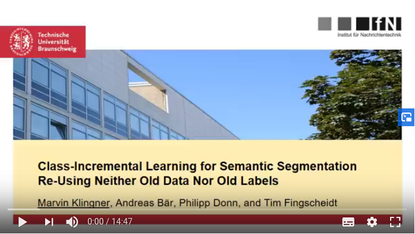
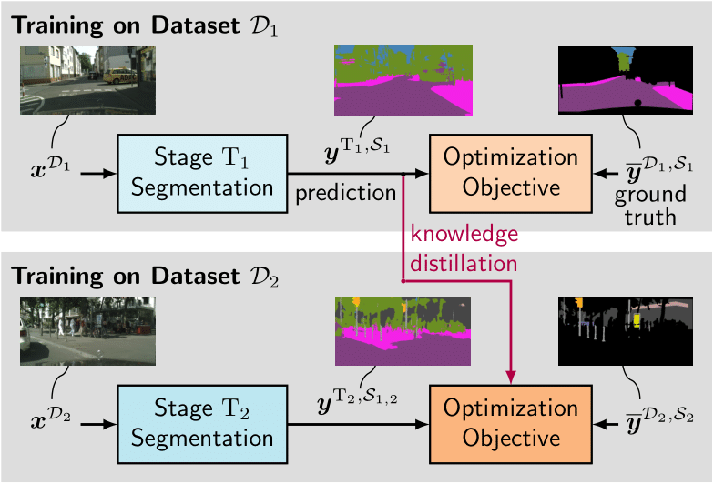

# Class-Incremental Learning for Semantic Segmentation Re-Using Neither Old Data Nor Old Labels
Marvin Klingner, Andreas Bär, Philipp Donn and Tim Fingscheidt

Link to our Paper: https://arxiv.org/abs/2005.06050

<p align="center">
  <a href="https://drive.google.com/file/d/1w0twOCadclEOrE7NbG3MmWOKNakdNjFa/view">
  
  </a>
</p>

## Citing
If you find our code helpful or interesting for your research, please consider citing
```
@InProceedings{Klingner2020b,
author = {Klingner, Marvin and B\"{a}r, Andreas and Donn, Philipp and Fingscheidt, Tim},
booktitle = {Proc. of ITSC},
title = {{Class-Incremental Learning for Semantic Segmentation Re-Using Neither Old Data Nor Old Labels}},
year = {2020},
}
```

## About CIL
<p align="center">

</p>

We present a technique implementing <b>class-incremental learning for semantic segmentation</b> without using the labeled data the model was initially trained on. Thereby, our method requires labels only for the new classes on new data. Specifically, we introduce a new loss function that neither relies on old data nor on old labels, and thereby show how new classes can be integrated in a modular fashion into pretrained semantic segmentation models. We evaluate our method on the Cityscapes dataset, reaching a result, which is only 2.2% below the upper mIoU performance limit of single-stage training, where the model is trained with all classes at once.

<b>Model trained incrementally with our method:</b>
 
<b>Baseline-model trained with all classes at once</b>


### Our Models

We evaluate the performance on the single tasks, i.e., subsets of classes of the Cityscapes dataset (check out our paper for the exact definitions), and also on the cross-task metrics over several subsets. The  mIoU Task 1∪2∪3 metric represents the usual mIoU over 19 classes defined in the Cityscapes dataset.

Model | mIoU Task 1 | mIoU Task2 | mIoU Task 1∪2 | mIoU Task 3 | mIoU Task 1∪2∪3 |
--- | --- | --- | --- |--- | --- |
CIL | 84.5 | 57.8 | 64.0 | 68.4 | 62.2 |
Baseline | 88.1 | 65.6 | 70.8 | 63.8 | 64.4 |

## Prerequisites and Requirements
We tested our code under Ubuntu 20.04 with

    - Python 3.7
    - Cuda 10.0
    - PyTorch 1.1

To run our code please proceed as follows:
1. Install all packages from the ```requierements.txt``` in the root folder. We recommend using Anaconda, where you can install our environment directly using the ```environment.yml``` file in the root folder.
2. In your project dir export the environment variable for the checkpoints: ```export IFN_DIR_CHECKPOINT=/path/to/folder/Checkpoints```
3. Download the Cityscapes dataset: *https://www.cityscapes-dataset.com/* and put it in a folder "Datasets"
4. Prepare the dataset folder:
    - export an environment variable to the root directory of all datasets: ```export IFN_DIR_DATASET=/path/to/folder/Dataset```
    - Place the <a href="https://drive.google.com/drive/folders/1Ky66UBRtMCBgu2qp6Nchd9psZkDgeuyT">json files</a> in your ```cityscapes``` folder. PLease take care, that the folder is spelled exactly as given here: ```"cityscapes"```.


## Inference 
For inference of the trained models, provide a path to the ```model.pth```. 
You can then infer pictures for example with:
```
python3 inference.py --checkpoint_path /home/workspace/Checkpoints/erfnet/erfnet_static_set123/models/weights_199/model.pth \
                     --model_stage 3 \
                     --task 123 \
                     --image /home/path/to/root/folder/of/dataset/cityscapes/leftImg8bit/val/frankfurt/frankfurt_000000_000294_leftImg8bit.png \
                     --output_path ./ 
```
Optional: You can also get the metrics for the processed picture by specifying the path to the ground truth image. Just add the following flag `--ground_truth /path/to/gt_image/gt_123.png`

## Evaluation
You can evaluate the trained models with the following command:
```
python3 evaluate/evaluate_erfnet.py --load_model_name erfnet_incremental_set123 \
                                    --train_set 123 \
                                    --weights_epoch 199 \
                                    --task_to_val 123
```

## Incremental Training

Train the first network with the first training data subset:
```
python3 train_erfnet_static.py --model_name erfnet_incremental_set1 \
                               --train_set 1 \
                               --num_epochs 200 \
                               --validate \
                               --city
```

Train the second network with the first network as a teacher on the second data subset:
```
python3 train_erfnet_incremental.py --model_name erfnet_incremental_set12 \
                                    --train_set 2 --num_epochs 200 \
                                    --validate \
                                    --teachers erfnet_static_set1 199 1 
```

Train the third network with the second network as a teacher on the third data subset:
```
python3 train_erfnet_incremental.py --model_name erfnet_incremental_set123 \
                                    --train_set 3 \
                                    --num_epochs 200 \
                                    --validate \
                                    --teachers erfnet_incremental_set12 199 2
```

## Baseline Training

For training of our baseline model

```
python3 train_erfnet_static.py --model_name erfnet_static_set123 \
                               --train_set 123 \
                               --num_epochs 200
```

## Pre-trained models
You can download our pre-trained models here:

<a href="https://drive.google.com/drive/folders/1kd44z9oE_ED502qSemOqkT1sY--YMIGl">erfnet_incremental_set1</a>

<a href="https://drive.google.com/drive/folders/1dPn5DTDl_gTYGCeiN8-eap-c2WbUerl_">erfnet_incremental_set12</a>

<a href="https://drive.google.com/drive/folders/1GVNM8T7EGkDYbhLC9Dv1G8t2dwmJ9Cxm">erfnet_incremental_set123</a>

<a href="https://drive.google.com/drive/folders/11aG8aps07z-gmFsxy10qoq73q4BvV81L">erfnet_static_set123</a>

and evaluate them with the commands above.

## Other Datasets

Of course our proposed method is compatible with other datasets and architectures. If you want to use other than the proposed Cityscapes dataset and ERFNet 
please consider getting familiar with our <a href="">dataloader</a> *(Link to dataloader repo will follow once it is published)*

## License

The <b>ERFNet</b> model used in this project was developed by E. Romera et al. <a href="https://github.com/Eromera/erfnet_pytorch">here</a>. The project was released under the *Creative Commons Attribution-NonCommercial 4.0 International License*. Our CIL Code is also licensed under the *Creative Commons Attribution-NonCommercial 4.0 International License*, which allows for <strong>personal and research use only</strong>.

View the license summary here: http://creativecommons.org/licenses/by-nc/4.0/


Our dataloader in the ```dataloader/``` directory will also be released, but under the MIT license and can therefore be used more freely. It is published in a separate GitHub repository *(Link to dataloader repo will follow once it is published)*.
